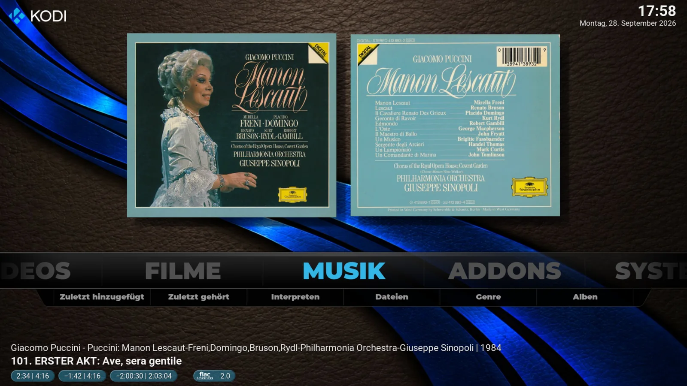
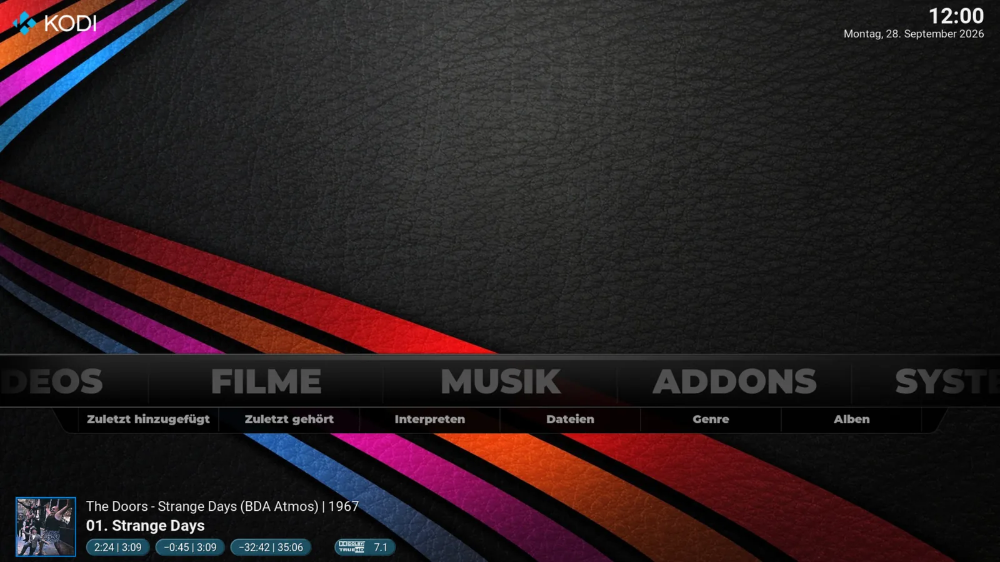
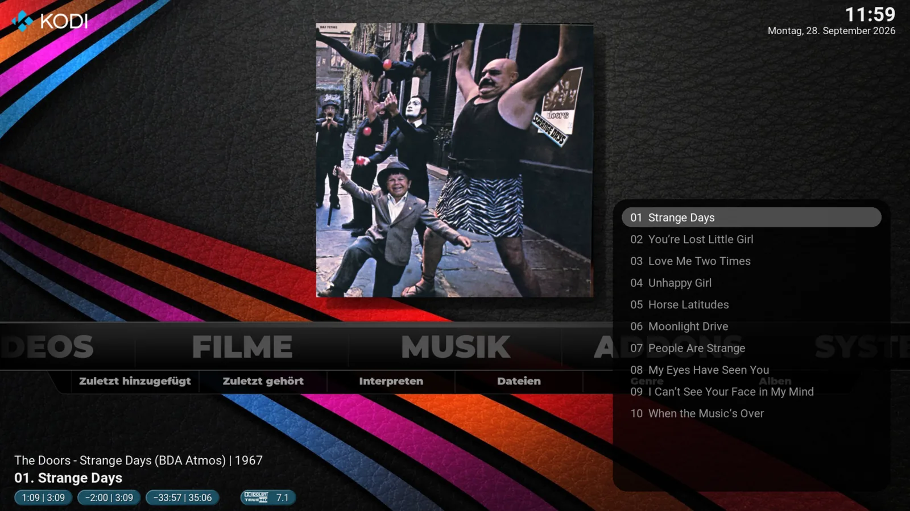
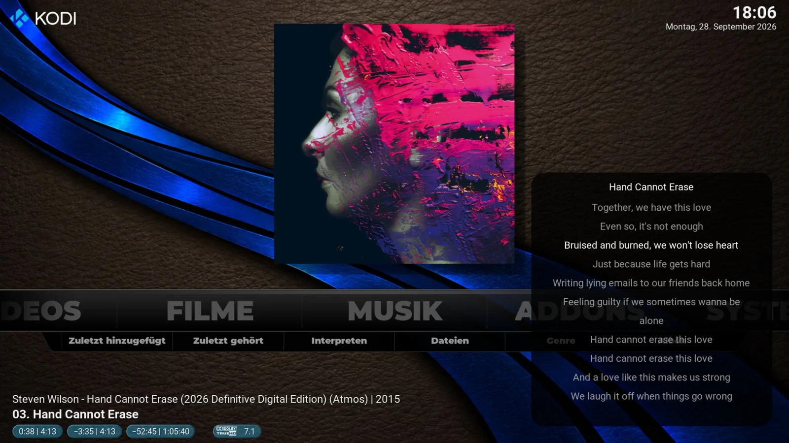
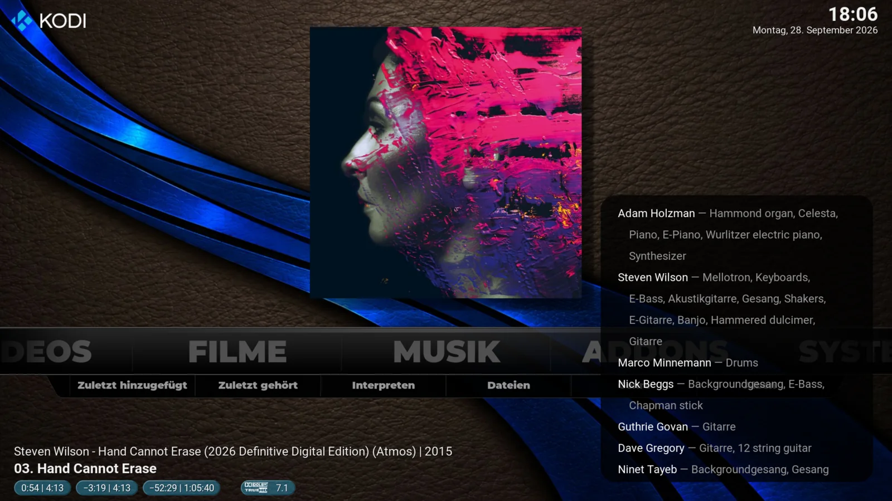

# Confluence-jjs

Confluence-jjs is a customized **Confluence skin for Kodi 21 (Omega)**, based on the original work by **Jezz_X / Team Kodi**.

The main goal is to preserve the simple and direct Confluence experience while improving music presentation and configurability.

## Overview

Confluence-jjs keeps the familiar Confluence home screen while adding more information about the currently playing music and extended artwork options.

The artwork display can be enlarged and can show the front and back cover together.

Three additional playback layouts show a large cover, compact cover and an information-only view.

## Main additions

- improved artwork display, including optional back covers
- configurable fonts, colors and font sizes
- more information about the currently playing music, including timing, format, DOR, lyrics and credits
- configurable home screen, main menu and submenus
- menu options that standard Confluence does not expose, such as **Files** in the Music submenu
- integrated menu editor without Skin Shortcuts
- selectable **Confluence-jjs** and **Standard Confluence** modes
- skin-settings backup/restore and bundled library-node defaults

The Confluence-jjs settings are organized into separate tabs for easier navigation.

## Song popup

The song popup provides track selection, synchronized lyrics and credits without leaving the home screen.

### Simple navigation

- Move the focus **above the main menu bar** to the artwork area. Press **Enter / OK** to cycle the artwork display.
- Move the focus **below the main menu bar** to open the song popup.
- Inside the popup, use **Left / Right** to switch between **Track list**, **Lyrics** and **Credits**.
- In the track list, use **Up / Down** to select a song and **Enter / OK** to start it.
- Press **Back** to close the popup.

### Track list

### Synchronized lyrics

### Credits

## Installation

Download the current release ZIP from **Releases** and install it in Kodi via:

**Add-ons → Install from zip file**

The package is named:

`skin.confluence.custom-<version>.zip`

## Add-on ID

The visible skin name is **Confluence-jjs**, but the technical add-on ID intentionally remains:

`skin.confluence.custom`

This preserves normal update behavior and existing skin settings. Changing the ID would make Kodi treat it as a different skin.

## Private project and disclaimer

Confluence-jjs was created solely for my own private use. I make it available to interested users in case it is useful to them as well.

The software is provided **as is** and is used entirely at your own risk. No warranty or guarantee is given regarding functionality, reliability, compatibility, fitness for a particular purpose or freedom from errors.

To the extent permitted by applicable law, I accept no liability for direct or indirect damage, data loss, system problems, incompatibilities or other consequences resulting from the installation or use of this project.

There is **no obligation to provide support, maintenance, bug fixes, compatibility updates or future releases**. Development may be changed, paused or discontinued at any time without notice.

Nothing in this disclaimer overrides the terms of the applicable license or any liability that cannot legally be excluded.

## Development

The release workflow validates the skin XML, Python files and ZIP structure before publishing a directly installable release package.

## Credits and license

Based on **Confluence by Jezz_X / Team Kodi**.

License: **GNU General Public License version 2**.
